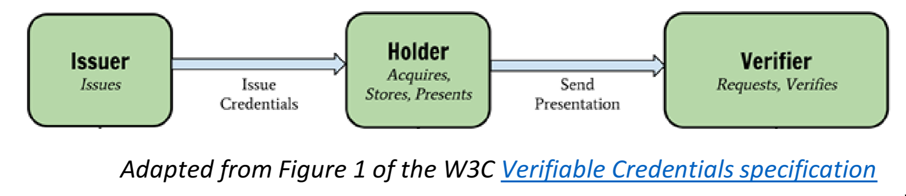

# Verify Vax

## Mission

An easy to use website that can scan QR codes using the [SMART Health Card Framework](https://spec.smarthealth.cards/) to verify the COVID-19 vaccination status of individuals.

### Verifier

This project satisfies the _verifier_ (or _venue_) piece of the model. This allows venues to verify the integrity and accuracy of presented QR codes, a service that at the time of creation is generally unavailable to venues wishing to check vaccination records of patrons.

(***UPDATE:*** The Commons Project has released a public [Verifier app](https://thecommonsproject.org/smart-health-card-verifier) that effectively replaces this website. I will leave this up and running for the time being though in case anyone doesn't want to download an app or wants to wait for further development on that app before using it.)

### Issuer

The website makes no judgement on what issuer is trustworthy or not - that is up to the individual venue to decide. The URL of the issuer is presented at the top of the page when scanning to give as much information as possible. At present, the trustworthy issuers I am aware of are California, Louisiana, and Walmart and Sam's Club pharmacies. The New York sate Excelsior pass and Healthvana QR codes are NOT SMART Health Cards, and so cannot be scanned.

### Holder

The holder, in this case, is the individual presenting their own information for verification. They may present a screenshot of the QR code on their phone from one of the above issuers, a QR code saved to an app such as Apple Wallet or The Commons Project's [CommonHealth](https://thecommonsproject.org/commonhealth) or [CommonPass](https://thecommonsproject.org/commonpass) app.

## Try it out

<https://verifyvax.herokuapp.com/>

This website is a major update to the demo [verifier portal](https://demo-portals.smarthealth.cards/VerifierPortal.html) which is available open source from the [SMART on FHIR](https://github.com/smart-on-fhir/health-cards-tests/tree/master/demo-portals) Github, using the MIT License Copyright by the Computational Health Informatics Program, Boston Children's Hospital, Boston, MA.

All of this code is open source. Currently, the website runs on a Node Express server hosted on Heroku because each section is connected to the next through an Express API (though all computation is done client-side). However, there is no reason that everything couldn't be processed completely client-side, eliminating the need for a server, as evidenced by Andrew Brampton's [scanner demo](https://bramp.github.io/smart-health-card-scanner/).

While data is sent back and forth to the server, nothing is recorded beyond simply logging what endpoints are being used. No data is saved or retrievable outside of the browser.

## Development

1. The project uses [node.js](https://nodejs.org/) and [npm](https://docs.npmjs.com/downloading-and-installing-node-js-and-npm).

2. Download the source, for example:

                git clone https://github.com/Martination/VerifyVax.git
                cd VerifyVax

3. Build the npm package:

                npm install
                npm run build
                npm run build-docs

4. Serve the website locally at [`localhost:8080`](http://localhost:8080/) by default (edit `src/config.ts` to change this):

                npm run node
